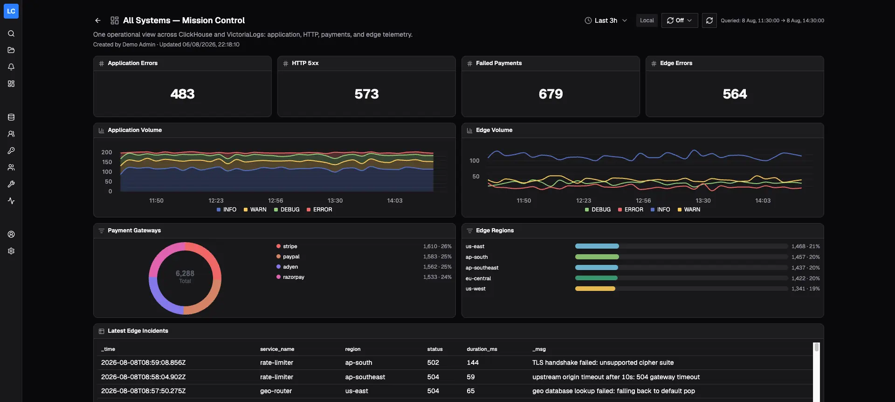

[Logchef](https://github.com/mr-karan/logchef) is a query and UI layer that connects directly to an existing VictoriaLogs deployment. It does not ingest, copy, or move logs. Your existing log shipper continues to send data to VictoriaLogs.

## Before you begin

Use Logchef v2.0.2 or later. You need a reachable VictoriaLogs base URL and credentials if your deployment requires them. See the [Logchef quickstart](https://logchef.app/getting-started/quickstart/) to deploy Logchef, or try the [Logchef demo](https://demo.logchef.app).

Logchef sends queries to VictoriaLogs using [LogsQL](https://docs.victoriametrics.com/victorialogs/logsql/). If your VictoriaLogs deployment uses tenants, review the [VictoriaLogs multitenancy documentation](https://docs.victoriametrics.com/victorialogs/#multitenancy).

## Add a VictoriaLogs source

As a global admin:

1. Open **Sources**, select **Add Source**, and choose **VictoriaLogs**.
2. Enter the VictoriaLogs **Base URL**.
3. Select an authentication method: **No Auth**, **Basic Auth**, or **Bearer Token**.
4. If you use VictoriaLogs multitenancy, enter **Account ID** and **Project ID** together. Both are required and must be numeric unsigned 32-bit integer values. Logchef sends them as `AccountID` and `ProjectID` request headers.
5. Optionally set an **Immutable Scope Query** to constrain the source.
6. Set **Timestamp Field** to `_time`. Set **Severity Field** to the field in your dataset that contains severity, such as `level`.
7. Validate the source, then save it.
8. Assign the saved source to the team that should access it.

The base URL must be reachable from the Logchef process. If Logchef and VictoriaLogs run in different Docker containers, use the VictoriaLogs service name or another container-reachable address. Do not use `localhost` to refer to a different container.

An immutable scope and tenant settings apply server-side to every query, histogram, field-values lookup, live tail, and alert evaluation issued through Logchef. For example, a scope can restrict a source to `kubernetes.namespace:="prod"`. Direct access to VictoriaLogs is outside Logchef's team and scope controls.

For detailed source configuration, see the [Logchef VictoriaLogs tutorial](https://logchef.app/tutorials/victorialogs/).

## Choose a query mode

Use LogchefQL for straightforward filters that use the same syntax across supported backends:

```text
level="error" and service="api"
```

Use native LogsQL for VictoriaLogs-specific syntax and pipes:

```text
level:="error" service:="api" | fields _time, _msg, service, level
```

Logchef sends the selected time range to VictoriaLogs as `start` and `end` parameters. Use native LogsQL when you need its full query language. See the [LogsQL reference](https://docs.victoriametrics.com/victorialogs/logsql/) for syntax and pipe operators.

## Explore and operate on logs

With a VictoriaLogs source, Logchef provides field discovery, histograms, result views, saved queries and collections, dashboards, alerts, live tail, CLI/MCP access, and team access. Immutable scope and tenant settings continue to apply server-side for these source operations.



For explorer histograms and dashboard stat, time-series, and breakdown panels, use filter expressions. Table queries can use full native LogsQL pipes.

## Limitations

The following Logchef features are ClickHouse-only and are not available for VictoriaLogs sources:

- Surrounding-log context
- Full-result export or download
