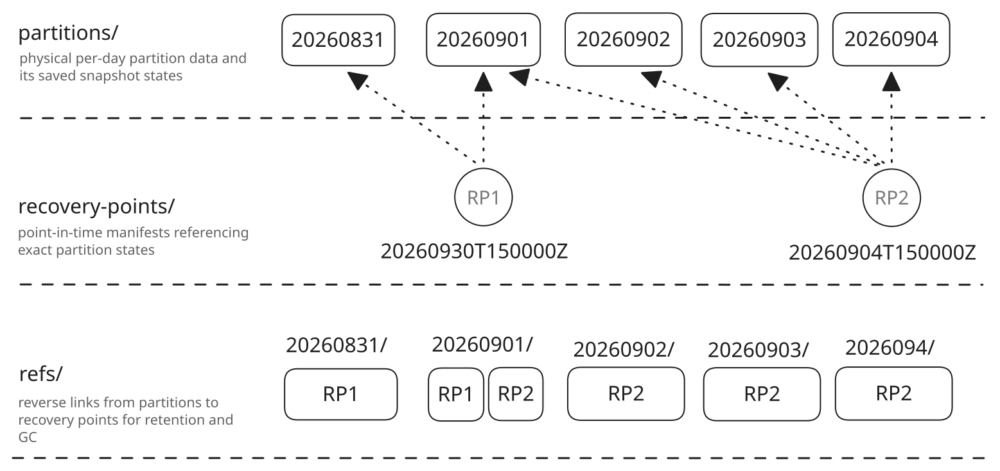

# VictoriaLogs Backup and Restore Tooling

Author: YurDuiachenko

## Background

Currently, there is no dedicated VictoriaLogs backup and restore tooling.

VictoriaMetrics already provides `vmbackup` and `vmrestore`, but these tools are designed around the VictoriaMetrics storage lifecycle and don't support VictoriaLogs-specific per-day partition snapshot and restore operations. 

VictoriaLogs documentation currently describes the backup process as a sequence of manual steps: create a partition snapshot, copy it to external storage with `rsync` or `rclone`, and delete the snapshot afterward.

This is a simple and flexible workflow, but it has several drawbacks:

- snapshot lifecycle, multi-partition consistency, and failed-backup handling must be orchestrated externally; interrupted backups may leave stale snapshots or incomplete backup state which requires manual cleanup;
- keeping multiple historical recovery points may duplicate immutable storage parts, increasing backup storage usage even when most partition data hasn't changed;
- repeated backups may transfer large amounts of already stored data unless incremental reuse is explicitly organized by the operator.

## High-level proposal

The proposal is to introduce two VictoriaLogs-specific binaries:

- `vlbackup` - creates full and selective backups of VictoriaLogs;
- `vlrestore` - restores VictoriaLogs from backups.

They will manage the VictoriaLogs-specific snapshot lifecycle and add a specific layout on top of the existing backup destination to support point-in-time recovery, 
reuse unchanged partition data without requiring server-side copies, and preserve historical partitions independently of VictoriaLogs retention.

Both tools will reuse the existing backup and restore libraries where possible instead of introducing a new backup engine or adding VictoriaLogs-specific logic to `vmbackup` and `vmrestore`.

A `vlbackupmanager` may be introduced later to provide scheduling on top of `vlbackup` and `vlrestore`.

## Goals

- Provide dedicated `vlbackup` and `vlrestore` tools for VictoriaLogs.
- Support full-storage and selective partition backup and restore.
- Support independent recovery points while reusing unchanged partition data without server-side copies.
- Handle VictoriaLogs partition snapshot lifecycle and partition-set capture automatically.

## Non-Goals

- Implementing a new backup or remote storage engine.
- Changing the VictoriaLogs storage format or partition layout.
- Implementing scheduling or cluster-wide orchestration.

---

## Detailed design

There are the following popular ways to make backups:

- Point in time backups for all the data currently stored at VictoriaLogs. Such backups are good for recovery of all the data seen during the backup moment (aka point in time recovery).
- Historical archives - to store data for historical days at the backup storage, so it could be restored and investigated if needed, even if this data is dropped at VictoriaLogs because of the configured retention.

Proposed binaries will provide functionality for both of this use cases due to the specific backup destination hierarchy: data only stored once, and then just referenced in backup metafiles.
That allows making very fast and cheap incremental backups, while they still can be properly restored.

Backup destination hierarchy looks like this:



Or more detailed like this:

```text
partitions/
  <partition>/
    data/
      datadb/
        <part-id>/...
      indexdb/
        <part-id>/...
    states/
      <state-id>/
        datadb/
          parts.json
        indexdb/
          parts.json

recovery-points/
  <recovery-point>.json

refs/
  <partition>/
    <recovery-point>
```

A recovery point contains a set of daily partition states.

Each partition has its own shared physical data pool under `partitions/<partition>/data/`.

The snapshot-specific metadata `datadb/parts.json` and `indexdb/parts.json` files are stored under an immutable `states/<state-id>/` directory.

`<state-id>` identifies the contents of these state files. Therefore, identical partition states may be shared by multiple recovery points, while a change in parts.json creates a new state.

A recovery-point manifest maps every partition included in the backup to the corresponding state:

```json
{
   "version": 1, 
   "id": "20260830T100000Z", 
   "created_at": "2026-08-30T10:00:00Z", 
   "scope": "full",
   "partitions": {
      "20260828": "<state-id-1>", 
      "20260829": "<state-id-2>", 
      "20260830": "<state-id-3>"
   }
}
```

`refs/<partition>/<recovery-point>` provides the reverse mapping for fast GC and retention mechanisms.

### vlbackup

The interface is intentionally similar to `vmbackup`:

```bash
./vlbackup \
  -partitionManage.url=http://localhost:9428/internal/partition \
  -dst=s3://<bucket>/<path/to/backup>
```

`-partitionManage.url` specifies the VictoriaLogs partition management API URL used for operations such as listing partitions and creating or deleting snapshots.

`-partitionManage.authKey` can be used when the partition management API is protected with `-partitionManageAuthKey`.

When `-partition` isn't specified, `vlbackup`:

1. Creates snapshots for all active VictoriaLogs partitions in a single partition snapshot API request.
2. For each partition snapshot:
   - uploads physical storage parts which aren't already present under `partitions/<partition>/data/`
   - stores snapshot metadata under `partitions/<partition>/states/<state-id>/`
   - adds `<partition>:<state-id>` records in the recovery-point manifest being built locally;
   - deletes the partition snapshot immediately after its data and state have been stored successfully.
3. Creates in batch `refs/<partition>/<recovery-point>` for every partition in the RP.
4. Writes the recovery-point manifest last as the commit record.

#### Partition selection

A particular partition can be selected with `-partition`:

```bash
./vlbackup \
  -partitionManage.url=http://localhost:9428/internal/partition \
  -partition=20260828 \
  -dst=s3://<bucket>/<path/to/backup>
```

In this case, the same RP creation workflow is performed as for full storage backup, but only for one partition.

#### Recovery point deletion

A recovery point can be deleted with:

```bash
./vlbackup delete \
  -dst=s3://<bucket>/<path/to/backup> \
  -recoveryPoint=20260830T100000Z
```

`vlbackup` reads the recovery-point manifest and removes:

```text
recovery-points/<recovery-point>.json
refs/<partition>/<recovery-point>
```

for every partition referenced by the recovery point (batch operation if possible).

Physical partition data isn't touched.

### Garbage collection

Physical destination cleanup and optional recovery-point retention are handled by `vlbackup gc`.

When retention policy isn't specified:

```bash
./vlbackup gc \
  -dst=s3://<bucket>/<path/to/repository>
```

GC only deletes unreferenced partitions, so it

1. Lists the stored partitions and performs a lightweight check for each one `LIST refs/<partition>/ MaxKeys=1`
2. If at least one object is returned, the partition is still referenced and is kept.
3. If the prefix is empty, no recovery point references the partition, so GC can remove `partitions/<partition>/`.

#### Recovery point retention

Recovery-point retention can be applied during GC:

```bash
./vlbackup gc \
  -dst=s3://<bucket>/<path/to/repository> \
  -recoveryPoint.retention=30d
```

The default value of `-recoveryPoint.retention` is `0`, which disables automatic recovery-point expiration.

When retention is enabled, GC first lists `recovery-points/` and determines expired recovery points from their timestamp-based IDs.

For every recovery point older than the configured retention period, GC:

1. reads its manifest to determine referenced partitions;
2. removes `recovery-points/<recovery-point>.json`;
3. removes the corresponding `refs/<partition>/<recovery-point>` objects (batch if possible).

It then performs the normal partition garbage collection.

#### Soft garbage collection

Physical partition deletion can be delayed with a grace period:

```bash
./vlbackup gc \
  -dst=s3://<bucket>/<path/to/repository> \
  -recoveryPoint.retention=30d \
  -soft \
  -gracePeriod=24h
```

When `-soft` is enabled and `refs/<partition>/` is empty, the partition isn't removed immediately. 
Instead, GC creates `gc-candidates/<partition>.json` containing the time when the partition was first observed as unreferenced.

On a later GC run, if the candidate is older than `-gracePeriod` (default is 24h), GC performs `LIST refs/<partition>/ MaxKeys=1` again and if the partition is still unreferenced, it is removed.

The grace period applies only to physical partition deletion. Recovery points which exceed `-recoveryPoint.retention` are removed immediately during the retention pass.

### vlrestore

A full recovery point can be restored with:

```bash
./vlrestore \
  -src=s3://<bucket>/<path/to/backup> \
  -recoveryPoint=20260830T100000Z \
  -storageDataPath=</path/to/victoria-logs-data> \
  -partitionManage.url=http://localhost:9428/internal/partition
```

`-partitionManage.url` is used for partition detach and attach operations. `-partitionManage.authKey` can be used when the partition management API is protected with `-partitionManageAuthKey`.

When `-partition` isn't specified, `vlrestore`:

1. Reads `recovery-points/<recovery-point>.json` and gets partitions list and their states.
2. For each partition in the recovery point:
   - loads the corresponding `datadb/parts.json` and `indexdb/parts.json` from `partitions/<partition>/states/<state-id>/`;
   - resolves the physical parts referenced by this state under `partitions/<partition>/data/`;
   - restores the selected partition into a temporary directory using the shared restore library;
   - writes the snapshot-specific `parts.json` files into the restored partition;
   - validates the restored partition;
   - detaches the corresponding local VictoriaLogs partition if it exists;
   - replaces the local partition data with the restored data;
   - attaches the restored partition.
3. After all partitions referenced by the recovery point have been restored successfully, removes local partitions which aren't present in the selected full recovery point.

Physical parts from other historical states of the same partition may coexist in `partitions/<partition>/data/`. During restore, only the parts referenced by the selected partition state are exposed to the shared restore logic.

#### Selective partition restore

A partition can be restored from a specific recovery point:

```bash
./vlrestore \
  -src=s3://<bucket>/<path/to/backup> \
  -recoveryPoint=20260830T100000Z \
  -partition=20260828 \
  -storageDataPath=</path/to/victoria-logs-data> \
  -partitionManage.url=http://localhost:9428/internal/partition
```

In this case, `vlrestore` takes the partition state from the selected recovery-point manifest and restores only that partition.

A partition can also be restored without explicitly selecting a recovery point:

```bash
./vlrestore \
  -src=s3://<bucket>/<path/to/backup> \
  -partition=20260828 \
  -storageDataPath=</path/to/victoria-logs-data> \
  -partitionManage.url=http://localhost:9428/internal/partition
```

`vlrestore` lists: `refs/20260828/` and selects the newest recovery-point. Since recovery-point IDs contain sortable timestamps, no separate `latest` pointer is needed.

The recovery-point manifest is then read to resolve the exact snapshot state for `20260828`.

Available recovery points can be listed with:

```bash
./vlrestore \
  -src=s3://<bucket>/<path/to/backup> \
  -list
```

### Backups on VLCluster

In a VLCluster, `vlbackup` should be run independently for every `vlstorage` node, with a separate destination path for each node.

For example:

```bash
vlstorage-1$ ./vlbackup -partitionManage.url=http://vlstorage-1:9491/internal/partition -dst=s3://<bucket>/vlstorage-1
vlstorage-2$ ./vlbackup -partitionManage.url=http://vlstorage-2:9491/internal/partition -dst=s3://<bucket>/vlstorage-2
vlstorage-3$ ./vlbackup -partitionManage.url=http://vlstorage-3:9491/internal/partition -dst=s3://<bucket>/vlstorage-3
```

---

## Metrics

`vlbackup` and `vlrestore` expose Prometheus-compatible metrics through the standard `/metrics` endpoint.

The proposed default listen addresses are:

- `vlbackup`: `:9420`;
- `vlrestore`: `:9421`.

The listen address can be configured with `-httpListenAddr`.

Metrics provided by the shared backup and restore libraries, such as `vm_backups_uploaded_bytes_total` and `vm_backups_downloaded_bytes_total`, are reused directly.

VictoriaLogs-specific metrics should cover:

- successfully processed and failed partitions and recovery points;
- backup and restore errors;
- backup and restore duration.

## Testing

### Unit tests

Unit tests should cover VictoriaLogs-specific logic introduced by `vlbackup` and `vlrestore`, including:

- partition discovery, selection, snapshot mapping, and destination mapping;
- VictoriaLogs snapshot and partition management API handling, including snapshot cleanup;
- recovery-point, partition-state, and reverse-reference handling, including incomplete backup state.

Generic backup and restore behavior is covered by the existing shared-library tests.

### Application tests

Application tests should run VictoriaLogs with temporary storage and cover:

- full and selective partition backup and restore;
- incremental backup with physical data reuse and creation of multiple recovery points for the same partition;
- restoring an older recovery point after a newer partition state has already been backed up;
- failed or incomplete multi-partition backups without exposing an incomplete recovery point.

Performance and resource usage should also be compared with the existing `rclone`-based workflow under ingestion and query load.

## Documentation

This proposal can serve as the basis for the `vlbackup` and `vlrestore` documentation, covering CLI usage, backup and restore workflows, metrics, and VLCluster usage.